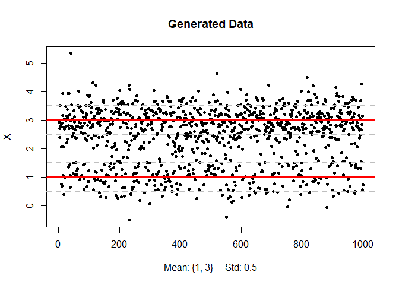
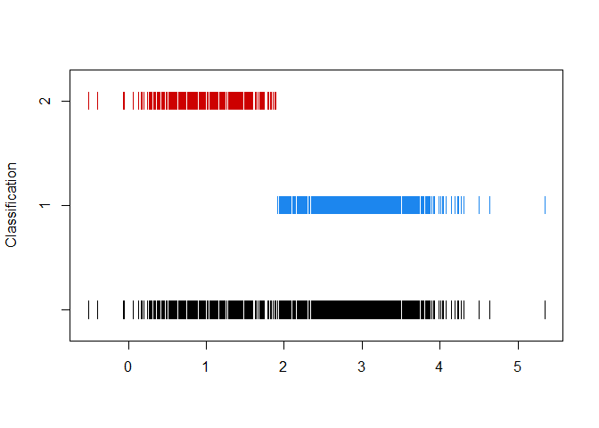
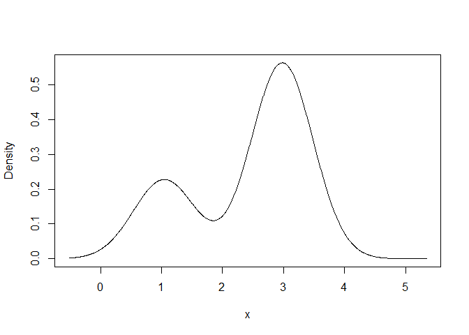
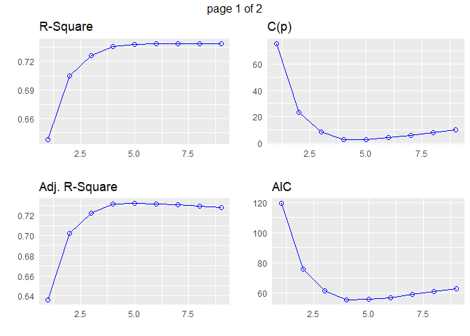
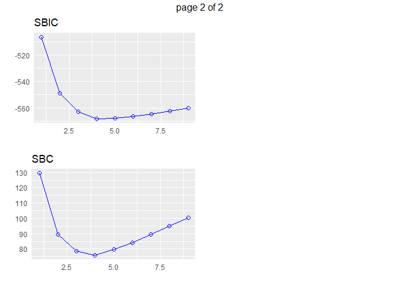
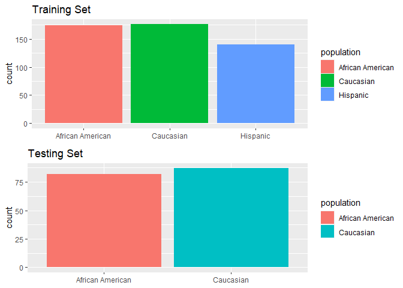
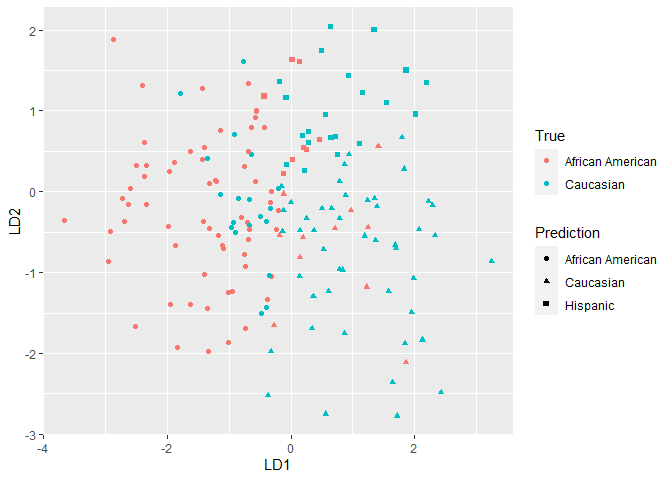
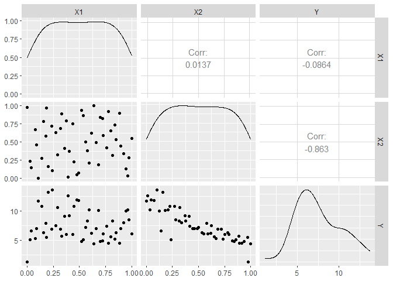
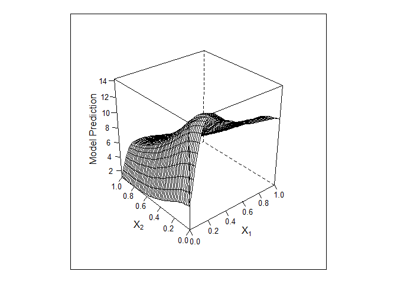
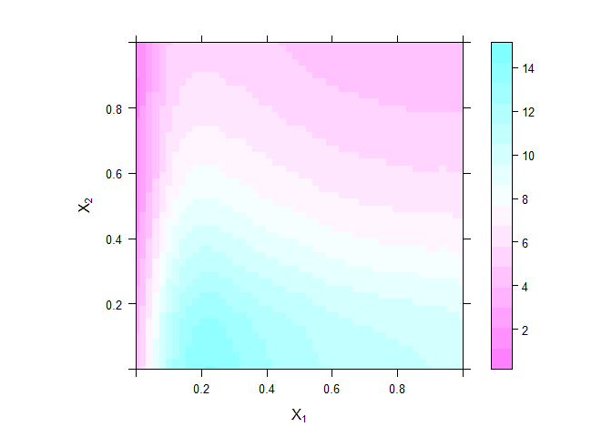

Analytics II, Final
================
SayedMohammad Hosseini (<mohammadhosseini@vt.edu>)

-----

### Problem 1, Likelihood Estimation Problem

#### Part (a)

Design and implement an algorithm to find the maximum likelihood
estimation for two normals with the same variance but different means.

#### Solution

``` r
## Reporting format
results <- as.data.frame(matrix(NA,nrow = 2, ncol = 4))
colnames(results) <- c("Mixing Pro.", "Mean.1", "Mean.2", "Variance")
row.names(results) <- c("True", "Estimated")

## Generate simulation data
set.seed(99)
p <- round(runif(1, min = 0, max = 0.5), 2)
X <- c(rnorm(1000*p, mean = 1, sd=0.5),
       rnorm(1000*(1-p), mean = 3, sd=0.5))
results[1,] <- c(p, 3, 1, 0.5^2)
print(results[1,])
```

    ##      Mixing Pro. Mean.1 Mean.2 Variance
    ## True        0.29      3      1     0.25

``` r
## Shuffle
indices <- sample(1:length(X), length(X))
X <- X[indices]

## Visualize the generated data
plot(X, pch=20, main="Generated Data", xlab = "Mean: {1, 3}     Std: 0.5")
abline(h = c(1, 3), col = 2, lwd = 2)
abline(h = c(0.5, 1.5, 2.5, 3.5), col = 8, lwd = 2, lty = 2)
```

<!-- -->

The EM algorithm has been implemented in `mclust` package in `R`. We
will use the functions in this package to manually carry out the
computation for this problem by iterating over E-step and M-step.  
We initialize the algorithm by picking two points from the data at
random that are far apart, say \(4\) and \(0\), as the means and setting
variance equal to the total sample variance.

``` r
## Initialize
library(mclust, quietly = TRUE)
k <- 2
centers <- c(4, 0)
variance <- var(X)
```

Having done this, we assign the points to the right of the midpoint
between the means (drawn points) to the first Gaussian and the rest to
the second one, then we have everything that we need to run the M-step
function and start the iteration.

``` r
#########
#| Lines in this code chunks were partially excerpted from:
#| Data Analytics: Part 10, Robert B. Gramacy (rbg@vt.edu : http://bobby.gramacy.com)
#########

## EM manually
z <- as.matrix(X > mean(centers))
e <- list(z = cbind(z, 1-z), loglik = NA)
loglik <- NA
loglik <- c(loglik, e$loglik)

## One true M-step
m <- mstepE(data = X, z = e$z)

## Iterate over E-step and M-step
for(i in 1:100){
    ## E-step
    e <- estepE(data = X, parameters = m$parameters)
    
    ## M-step
    m <- mstepE(data = X, z = e$z)
    
    ## Keep track of progress
    loglik <- c(loglik, e$loglik)}
```

#### Results and Comparison

``` r
## Estimated parameters
results[2,] <- c(m$parameters$pro[2], m$parameters$mean, m$parameters$variance$sigmasq)
print(m$parameters)
```

    ## $pro
    ## [1] 0.7122733 0.2877267
    ## 
    ## $mean
    ##        1        2 
    ## 2.980012 1.044139 
    ## 
    ## $variance
    ## $variance$modelName
    ## [1] "E"
    ## 
    ## $variance$d
    ## [1] 1
    ## 
    ## $variance$G
    ## [1] 2
    ## 
    ## $variance$sigmasq
    ## [1] 0.25483

``` r
## Classification plot
mclust1Dplot(X, parameters = m$parameters, z = m$z, what = "classification")
```

<!-- -->

``` r
## Density plot
mclust1Dplot(X, parameters = m$parameters, z = m$z, what = "density")
```

<!-- -->

``` r
## Estimated vs. True Parameters
print(results)
```

    ##           Mixing Pro.   Mean.1   Mean.2 Variance
    ## True        0.2900000 3.000000 1.000000  0.25000
    ## Estimated   0.2877267 2.980012 1.044139  0.25483

<br>

### Problem 2, Regression Problem

Use the `LA ozone` dataset. Divide the dataset into two groups at
random. One group, which we call the training data, containing \(2/3\)
of the observations and one group, which we call the test data, with
\(1/3\) of the observations. In the following you are asked to regress
the *cube root* of the ozone concentration on the other variables. You
should *only* use the training data for the estimation.

#### Part (a)

Analyze the data by considering different variable selection techniques.
Make comparison of the final models. Which final model would you
recommend? Justify your answers.

### Model Selection

First we add the *cube root of ozone*, `ozone.cubeRoot`, to the data set
and then divide into to the training and testing sets. We will use:

  - Forward-backward step-wise selection via BIC
  - LASSO via leave-one-out cross validation  
  - Best subset regression

to select a number of explanatory variables.

``` r
## Load data
LAozone <- read.delim("LAozone.txt", header = TRUE, sep = ",")
LAozone$ozone.cubeRoot <- (LAozone$ozone)^(1/3)
LAozone <- LAozone[,-1]
head(LAozone)
```

    ##     vh wind humidity temp  ibh dpg ibt vis doy ozone.cubeRoot
    ## 1 5710    4       28   40 2693 -25  87 250   3       1.442250
    ## 2 5700    3       37   45  590 -24 128 100   4       1.709976
    ## 3 5760    3       51   54 1450  25 139  60   5       1.709976
    ## 4 5720    4       69   35 1568  15 121  60   6       1.817121
    ## 5 5790    6       19   45 2631 -33 123 100   7       1.587401
    ## 6 5790    3       25   55  554 -28 182 250   8       1.587401

``` r
## Divide into training and testing sets
set.seed(99)
n <- nrow(LAozone)
size <- floor((2/3)*n)
train.ind <- sample(1:n,size ,replace = FALSE)
test.ind <- setdiff(1:n, train.ind)
train.LA <- LAozone[train.ind,]
train.LA.X <- as.matrix(train.LA[,-ncol(train.LA)])
train.LA.y <- as.matrix(train.LA[,ncol(train.LA)])
test.LA <- LAozone[test.ind,]
test.LA.X <- as.matrix(test.LA[,-ncol(test.LA)])
test.LA.y <- as.matrix(test.LA[,ncol(test.LA)])
```

#### Forward-backward Step-wise Selection via BIC

``` r
## Stepwise selection via BIC
ls.null <- lm(ozone.cubeRoot ~ 1, data = train.LA)
ls.full <- lm(ozone.cubeRoot ~ ., data = train.LA)
fwdbak <- step(ls.null, scope=formula(ls.full), direction="both", trace=0, k=log(nrow(train.LA)))
coef(fwdbak)
```

    ##   (Intercept)          temp           ibh      humidity           doy 
    ##  8.765234e-01  2.181853e-02 -7.702769e-05  3.948920e-03 -5.090966e-04

``` r
## Performance on the training set
cat("R2 =", summary(fwdbak)$r.squared)
```

    ## R2 = 0.7360774

#### LASSO via LOOCV

``` r
## Lasso via LOOCV
library(lars, quietly = TRUE)
lasso <- lars(train.LA.X, train.LA.y, type="lasso")
lasso.cv <- cv.lars(train.LA.X, train.LA.y, K=nrow(train.LA.X), plot.it=FALSE)

## Find min CV, convert to beta.hat
wm <- which.min(lasso.cv$cv)
tf <- lasso.cv$cv < lasso.cv$cv[wm] + lasso.cv$cv.error[wm]
lasso.cv.best <- lasso.cv$index[(1:nrow(train.LA.X))[tf][1]]
bhat.lasso <- coef(lasso, s=lasso.cv.best, mode="fraction")
print(bhat.lasso[bhat.lasso != 0.0])
```

    ##      humidity          temp           ibh 
    ##  1.970980e-03  1.873377e-02 -6.631895e-05

``` r
## Performance on the training set
cat("R2 =", max(lasso$R2))
```

    ## R2 = 0.7390566

#### Best Subset Regression

This method selects the subset of predictors that do the best at meeting
some well-defined objective criterion, such as having the largest
R-squared value or the smallest MSE, Mallow’s Cp or AIC.

``` r
## Best subset
library(olsrr, quietly = TRUE)
model <- lm(ozone.cubeRoot ~ ., data = train.LA)
k <- ols_step_best_subset(model)
print(k); plot(k)
```

    ##                 Best Subsets Regression                 
    ## --------------------------------------------------------
    ## Model Index    Predictors
    ## --------------------------------------------------------
    ##      1         temp                                      
    ##      2         temp ibh                                  
    ##      3         humidity temp ibh                         
    ##      4         humidity temp ibh doy                     
    ##      5         humidity temp ibh vis doy                 
    ##      6         humidity temp ibh dpg vis doy             
    ##      7         wind humidity temp ibh dpg vis doy        
    ##      8         wind humidity temp ibh dpg ibt vis doy    
    ##      9         vh wind humidity temp ibh dpg ibt vis doy 
    ## --------------------------------------------------------
    ## 
    ##                                                    Subsets Regression Summary                                                    
    ## ---------------------------------------------------------------------------------------------------------------------------------
    ##                        Adj.        Pred                                                                                           
    ## Model    R-Square    R-Square    R-Square     C(p)        AIC         SBIC         SBC        MSEP       FPE       HSP      APC  
    ## ---------------------------------------------------------------------------------------------------------------------------------
    ##   1        0.6376      0.6360      0.6316    75.6152    119.2245    -506.2114    129.4053    21.7484    0.0998    5e-04    0.3690 
    ##   2        0.7052      0.7025      0.6965    23.2728     75.8551    -548.9253     89.4296    17.7775    0.0819    4e-04    0.3030 
    ##   3        0.7261      0.7223      0.7152     8.4056     61.6321    -562.7156     78.6002    16.5906    0.0768    4e-04    0.2840 
    ##   4        0.7361      0.7312      0.7228     2.3976     55.4899    -568.4877     75.8517    16.0625    0.0747    3e-04    0.2762 
    ##   5        0.7380      0.7319      0.7224     2.8595     55.8910    -567.9255     79.6464    16.0210    0.0748    3e-04    0.2767 
    ##   6        0.7389      0.7316      0.7191     4.0887     57.0853    -566.5916     84.2343    16.0378    0.0752    3e-04    0.2782 
    ##   7        0.7390      0.7304      0.7169     6.0309     59.0247    -564.5533     89.5674    16.1093    0.0759    3e-04    0.2807 
    ##   8        0.7391      0.7292      0.7139     8.0043     60.9968    -562.4839     94.9331    16.1840    0.0766    4e-04    0.2832 
    ##   9        0.7391      0.7279      0.7108    10.0000     62.9924    -560.3927    100.3223    16.2611    0.0773    4e-04    0.2858 
    ## ---------------------------------------------------------------------------------------------------------------------------------
    ## AIC: Akaike Information Criteria 
    ##  SBIC: Sawa's Bayesian Information Criteria 
    ##  SBC: Schwarz Bayesian Criteria 
    ##  MSEP: Estimated error of prediction, assuming multivariate normality 
    ##  FPE: Final Prediction Error 
    ##  HSP: Hocking's Sp 
    ##  APC: Amemiya Prediction Criteria

<!-- --><!-- -->

As we can see, R-squared and Cp flatten out after model 4 and also other
information criteria are at minimum so we pick this model which exactly
the same result as step-wise selection method.

``` r
## Report results
best <- lm(ozone.cubeRoot ~ humidity + temp + ibh + doy, data = train.LA)
coef(best)
```

    ##   (Intercept)      humidity          temp           ibh           doy 
    ##  8.765234e-01  3.948920e-03  2.181853e-02 -7.702769e-05 -5.090966e-04

``` r
## Performance on the training set
cat("R2 =", summary(best)$r.squared)
```

    ## R2 = 0.7360774

Performance of the models are almost the same on the training set.

### Prediction Accuracy

Now we use the developed models and compare their performance on the
testing set.

``` r
## Prediction on the testing set 
p.best <- predict(best, newdata=test.LA)
p.fwdbak <- predict(fwdbak, newdata=test.LA)
p.lasso <- predict(lasso, test.LA.X, s=lasso.cv.best, mode="fraction")$fit

## Prediction error
mse.best <- mean((p.best - test.LA.y)^2)
mse.fwdbak <- mean((p.fwdbak - test.LA.y)^2)
mse.lasso <- mean((p.lasso - test.LA.y)^2)
rmse <- data.frame("Best subset" = sqrt(mse.best),
                   "Forward-backward" = sqrt(mse.fwdbak),
                   "LASSO" = sqrt(mse.lasso))
rownames(rmse)  <- "RMSE:"
print(rmse)
```

    ##       Best.subset Forward.backward     LASSO
    ## RMSE:   0.2820418        0.2820418 0.3023455

Based on the reported results, we pick the model selected by the
step-wise and best subset approaches since it outperforms the LASSO
model on the testing set.

<br>

### Problem 3, Classification Problem

The traing and test data sets can be found from ‘geno train.txt’ and
‘geno test.txt’. Each contain \(16\) columns of data from different
individuals, with the first \(15\) being the genetic fingerprint (the
count of the number of repeats for certain so-called tandem repeats in
the genome) and the last being the population variable. The purpose is
to predict the population from the genetic fingerprint. We refer below
to the repeat counts as the count data (the \(x\) variables) and the
population as the group (the \(y\) variable).

#### Part (a)

Use LDA, QDA, and SVM for classification and compare the
misclassification rate on the test data set.

``` r
## Load training and testing sets
library(ggplot2, quietly = TRUE)
library(gridExtra, quietly = TRUE)
library(tidyverse, quietly = TRUE)
library(caret, quietly = TRUE)
train.geno <- read.delim("geno_train.txt", header = TRUE, sep = ",")
test.geno <- read.delim("geno_test.txt", header = TRUE, sep = ",")
str(train.geno)
```

    ## 'data.frame':    490 obs. of  16 variables:
    ##  $ D8S1179   : int  21 29 22 26 29 31 27 27 26 24 ...
    ##  $ D21S11    : num  59 55 60 61.2 63.2 58 56 66 60 55.2 ...
    ##  $ D7S820    : num  17 20 19 17 20 21 23 21 22 21 ...
    ##  $ CSF1PO    : num  21 18 21 20 24 23 20 22 22 24 ...
    ##  $ D3S1358   : num  34 33 32 31 33 32 33 31 31 31 ...
    ##  $ TH01      : num  13 15.3 16 16 15.3 15.3 15 16 18.3 18.6 ...
    ##  $ D13S317   : int  22 23 22 21 26 24 26 23 22 23 ...
    ##  $ D16S539   : int  23 26 22 22 24 24 19 23 24 22 ...
    ##  $ D2S1338   : int  41 38 46 44 43 42 43 44 43 37 ...
    ##  $ D19S433   : num  30.2 27 25 27 28 28 28 30.4 29 27 ...
    ##  $ vWA       : int  33 36 33 35 34 36 36 32 33 32 ...
    ##  $ TPOX      : int  19 21 21 19 16 18 20 16 16 19 ...
    ##  $ D18S51    : num  35 35 25 28 28 27 41 35 34 34 ...
    ##  $ D5S818    : int  24 26 22 22 25 21 22 24 25 22 ...
    ##  $ FGA       : num  47 47 40 47 43 45 47 42 43 43 ...
    ##  $ population: Factor w/ 3 levels "African American",..: 2 1 2 1 2 2 1 1 2 2 ...

``` r
## Visualize the sets
grid.arrange(
ggplot(data = train.geno, aes(x = population, fill = population)) + 
  geom_histogram(stat = "count") + 
  theme(axis.title.x = element_blank()) + 
  ggtitle("Training Set"),
ggplot(data = test.geno, aes(x = population, fill = population)) + 
  geom_histogram(stat = "count") + 
  theme(axis.title.x = element_blank()) + 
  ggtitle("Testing Set"), nrow = 2)
```

<!-- -->

### LDA

Since the discriminant analysis could be affected by the scale/unit of
the predictor variables, we first center and normalize the data and then
run the analysis.

``` r
library(MASS, quietly = TRUE)
require(ggplot2, quietly = TRUE)
results <- as.data.frame(matrix(NA, nrow = 1, ncol = 4))
colnames(results) <- c("LDA", "QDA", "SVM.Linear", "SVM.Radial")
rownames(results) <- "Misclass. Rate:"

## Estimate preprocessing parameters
preproc.param <- train.geno %>% preProcess(method = c("center", "scale"))

## Transform the data using the estimated parameters
train.transformed <- preproc.param %>% predict(train.geno)
test.transformed <- preproc.param %>% predict(test.geno)

## Fit the model
lda <- lda(population ~ ., data = train.transformed)
lda
```

    ## Call:
    ## lda(population ~ ., data = train.transformed)
    ## 
    ## Prior probabilities of groups:
    ## African American        Caucasian         Hispanic 
    ##        0.3551020        0.3591837        0.2857143 
    ## 
    ## Group means:
    ##                     D8S1179      D21S11      D7S820     CSF1PO     D3S1358
    ## African American  0.3847503 -0.10521595 -0.19402017 -0.4124722 -0.16606005
    ## Caucasian        -0.2902518 -0.01604069 -0.02539054  0.3093008  0.13961505
    ## Hispanic         -0.1133016  0.15093382  0.27305889  0.1238088  0.03087285
    ##                         TH01    D13S317     D16S539     D2S1338     D19S433
    ## African American -0.23455639  0.3739076 -0.28977434  0.09021559 -0.29450126
    ## Caucasian         0.21572155 -0.1112290  0.24104728  0.07506975  0.23251854
    ## Hispanic          0.02032728 -0.3248830  0.05711724 -0.20649849  0.07371397
    ##                          vWA        TPOX     D18S51     D5S818         FGA
    ## African American -0.11938284 -0.23060721  0.3144300  0.1416953  0.26935118
    ## Caucasian         0.14608344  0.04154075 -0.2182081  0.0244197 -0.34439026
    ## Hispanic         -0.03527194  0.23438916 -0.1164727 -0.2068060  0.09818271
    ## 
    ## Coefficients of linear discriminants:
    ##                 LD1          LD2
    ## D8S1179 -0.41039083  0.084984983
    ## D21S11   0.10464206  0.186207134
    ## D7S820   0.17584608  0.414239553
    ## CSF1PO   0.56507255 -0.075987846
    ## D3S1358  0.25725567  0.001877799
    ## TH01     0.23970807 -0.187743032
    ## D13S317 -0.32033309 -0.427521557
    ## D16S539  0.28097022 -0.045458671
    ## D2S1338 -0.08397841 -0.359920808
    ## D19S433  0.32124620 -0.132233315
    ## vWA      0.11197261 -0.233967820
    ## TPOX     0.19695804  0.268889777
    ## D18S51  -0.44854004  0.058579962
    ## D5S818  -0.09764449 -0.314573015
    ## FGA     -0.28367594  0.462677872
    ## 
    ## Proportion of trace:
    ##    LD1    LD2 
    ## 0.8676 0.1324

``` r
## Make predictions
predictions <- lda %>% predict(test.transformed)

## Visualize the results
plot.lda <- data.frame(predictions$x[,-ncol(test.geno)], 
                      "True" = test.geno[,ncol(test.geno)],
                      "Prediction" = predictions$class)
ggplot(plot.lda, aes(x = LD1, y = LD2, color = True, shape = Prediction)) + geom_point()
```

<!-- -->

``` r
## Confusion matrix
lda.confusion <- table(predictions$class, test.geno$population)
print(lda.confusion)
```

    ##                   
    ##                    African American Caucasian
    ##   African American               63        19
    ##   Caucasian                      11        47
    ##   Hispanic                        8        21

``` r
## Misclassification rate
lda.misclass <- 1 - sum(diag(lda.confusion))/sum(lda.confusion)
results$LDA <- lda.misclass
cat("Misclass. Rate =",lda.misclass)
```

    ## Misclass. Rate = 0.3491124

### QDA

``` r
## Fit the model
qda <- qda(population ~ ., data = train.transformed)
qda
```

    ## Call:
    ## qda(population ~ ., data = train.transformed)
    ## 
    ## Prior probabilities of groups:
    ## African American        Caucasian         Hispanic 
    ##        0.3551020        0.3591837        0.2857143 
    ## 
    ## Group means:
    ##                     D8S1179      D21S11      D7S820     CSF1PO     D3S1358
    ## African American  0.3847503 -0.10521595 -0.19402017 -0.4124722 -0.16606005
    ## Caucasian        -0.2902518 -0.01604069 -0.02539054  0.3093008  0.13961505
    ## Hispanic         -0.1133016  0.15093382  0.27305889  0.1238088  0.03087285
    ##                         TH01    D13S317     D16S539     D2S1338     D19S433
    ## African American -0.23455639  0.3739076 -0.28977434  0.09021559 -0.29450126
    ## Caucasian         0.21572155 -0.1112290  0.24104728  0.07506975  0.23251854
    ## Hispanic          0.02032728 -0.3248830  0.05711724 -0.20649849  0.07371397
    ##                          vWA        TPOX     D18S51     D5S818         FGA
    ## African American -0.11938284 -0.23060721  0.3144300  0.1416953  0.26935118
    ## Caucasian         0.14608344  0.04154075 -0.2182081  0.0244197 -0.34439026
    ## Hispanic         -0.03527194  0.23438916 -0.1164727 -0.2068060  0.09818271

``` r
## Make predictions
predictions <- qda %>% predict(test.transformed)

## Confusion matrix
qda.confusion <- table(predictions$class, test.geno$population)
print(qda.confusion)
```

    ##                   
    ##                    African American Caucasian
    ##   African American               58        11
    ##   Caucasian                      12        54
    ##   Hispanic                       12        22

``` r
## Misclassification rate
qda.misclass <- 1 - sum(diag(qda.confusion))/sum(qda.confusion)
results$QDA <- qda.misclass
cat("Misclass. Rate =", qda.misclass)
```

    ## Misclass. Rate = 0.3372781

### SVM

#### Linear Kernel

``` r
library(e1071, quietly = TRUE)

## Fit the model
svm <- svm(population ~ ., data = train.transformed, kernel = "linear", scale = FALSE)
print(svm)
```

    ## 
    ## Call:
    ## svm(formula = population ~ ., data = train.transformed, kernel = "linear", 
    ##     scale = FALSE)
    ## 
    ## 
    ## Parameters:
    ##    SVM-Type:  C-classification 
    ##  SVM-Kernel:  linear 
    ##        cost:  1 
    ## 
    ## Number of Support Vectors:  349

``` r
## Make predictions
predictions <- svm %>% predict(test.transformed)

## Confusion matrix
svm.confusion <- table(predictions, test.geno$population)
print(svm.confusion)
```

    ##                   
    ## predictions        African American Caucasian
    ##   African American               61        19
    ##   Caucasian                      12        47
    ##   Hispanic                        9        21

``` r
## Misclassification rate
svm.misclass <- 1 - sum(diag(svm.confusion))/sum(svm.confusion)
results$SVM.Linear <- svm.misclass
cat("Misclass. Rate =", svm.misclass)
```

    ## Misclass. Rate = 0.3609467

#### Non-linear Kernel

``` r
## Fit the model
svm <- svm(population ~ ., data = train.transformed, kernel = "radial", scale = FALSE)
print(svm)
```

    ## 
    ## Call:
    ## svm(formula = population ~ ., data = train.transformed, kernel = "radial", 
    ##     scale = FALSE)
    ## 
    ## 
    ## Parameters:
    ##    SVM-Type:  C-classification 
    ##  SVM-Kernel:  radial 
    ##        cost:  1 
    ## 
    ## Number of Support Vectors:  416

``` r
## Make predictions
predictions <- svm %>% predict(test.transformed)

## Confusion matrix
svm.confusion <- table(predictions, test.geno$population)
print(svm.confusion)
```

    ##                   
    ## predictions        African American Caucasian
    ##   African American               61        15
    ##   Caucasian                      11        57
    ##   Hispanic                       10        15

``` r
## Misclassification rate
svm.misclass <- 1 - sum(diag(svm.confusion))/sum(svm.confusion)
results$SVM.Radial <- svm.misclass
cat("Misclass. Rate =", svm.misclass)
```

    ## Misclass. Rate = 0.3017751

### Comparison

``` r
## Compare the misclassification rate
print(results)
```

    ##                       LDA       QDA SVM.Linear SVM.Radial
    ## Misclass. Rate: 0.3491124 0.3372781  0.3609467  0.3017751

<br>

### Problem 4, Gaussian Process Regression

There are two data sets, “Pr6 training.txt” as training data set, “Pr6
test.txt” as test data set. It contains two input variables `X1`, `X2`
and one output variable `Y`.

#### Part (a)

Consider the kernel ridge regression and Gaussian process regression to
fit the data. Make comparison of the final models.

``` r
## Load training and testing sets
train.gp <- read.delim("Pr6_training.txt", header = TRUE, sep = " ")
test.gp <- read.delim("Pr6_test.txt", header = TRUE, sep = " ")
str(train.gp)
```

    ## 'data.frame':    50 obs. of  3 variables:
    ##  $ X1: num  0.697 0.73 0.851 0.49 0.36 ...
    ##  $ X2: num  0.8436 0.5885 0.5361 0.0754 0.4106 ...
    ##  $ Y : num  4.81 6.09 6.29 11.77 9.04 ...

``` r
## Explore
library(tidyverse, quietly = TRUE)
library(GGally, quietly = TRUE)
library(listdtr, quietly = TRUE)
ggpairs(train.gp)
```

<!-- -->

### Kernel Ridge Rigression

We will be using `R` built-in function `krr`to fit kernel ridge
regression, i.e. reproducing kernel Hilbert space regression.

``` r
X.train <- train.gp[, 1:2]
y.train <- train.gp[, 3]
X.test <- test.gp[, 1:2]
y.test <- test.gp[, 3]

## Reporting format
results <- as.data.frame(matrix(NA, nrow = 1, ncol = 2))
colnames(results) <- c("KRR", "GP")
rownames(results) <- "RMSE:"
```

``` r
## Fit the model
kernel.ridge <- krr(X.train, y.train)

## Make predictions
require(MLmetrics, quietly = TRUE)
predictions <- kernel.ridge %>% predict(X.test)
krr.mse <- MSE(predictions, y.test)
results$KRR <- sqrt(krr.mse)
cat("Kernel Ridge Rigression RMSE:", sqrt(krr.mse))
```

    ## Kernel Ridge Rigression RMSE: 0.2376328

### Gaussian Process

We run a Gaussian Process regression on the data using `GPfit` library
in `R`, then compare the models in terms of precition accuracy on the
testing set.

``` r
## Fit the model
library(GPfit, quietly = TRUE)
GPmodel <- GP_fit(X.train, y.train)
print(GPmodel)
```

    ## 
    ## Number Of Observations: n = 50
    ## Input Dimensions: d = 2
    ## 
    ## Correlation: Exponential (power = 1.95)
    ## Correlation Parameters: 
    ##     beta_hat.1 beta_hat.2
    ## [1]  0.7596379  -0.225464
    ## 
    ## sigma^2_hat: [1] 26.1341
    ## 
    ## delta_lb(beta_hat): [1] 0
    ## 
    ## nugget threshold parameter: 20

``` r
plot(GPmodel, range=c(0,1), resolution=50, surf_check=TRUE)
```

<!-- -->

``` r
plot(GPmodel, range=c(0,1), resolution=50, surf_check=FALSE, response=TRUE)
```

<!-- -->

``` r
## Make predictions
require(MLmetrics, quietly = TRUE)
predictions <- GPmodel %>% predict(X.test)
gp.mse <- MSE(predictions$Y_hat, test.gp$Y)
results$GP <- sqrt(gp.mse)
cat("Gaussian Process Rigression RMSE:", sqrt(gp.mse))
```

    ## Gaussian Process Rigression RMSE: 0.1236685

### Comparison

``` r
## Prediction accuracy on the testing set
print(results)
```

    ##             KRR        GP
    ## RMSE: 0.2376328 0.1236685

-----
